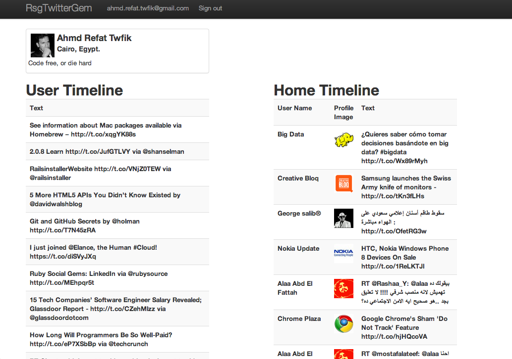

#Ruby Social Gems: Twitter gem

##Twitter Gem

In the pervious part of this series, we've covered [LinkedIn gem](https://github.com/pengwynn/linkedin), by building a simple application, to cover authentication, and APIs queries. We are going to build a similar simple application with [Twitter gem](https://github.com/sferik/twitter), for the same purposes.

Twitter gem, in contrast with LinkedIn gem, it doesn't provide authentication, so we'll have to use [oauth-ruby](https://github.com/oauth/oauth-ruby) gem to do the authentication. 

##The Demo Application
The application we are going to build with the Twitter gem, is going to be the same as, what we've build with LinkedIn. We will get all the user data from Twitter into our rails app models, so we can display it in whatever format we want.

Starting with the application:
> You can download the full source code of the tutorial form [github here](https://github.com/ahmdrefat/rsg_twitter_gem)

Create a new rails app:
`rails new rsg_twitter_gem`

Add the twitter, oauth, devise, bootstrap gems in `path/to/project/Gemfile`
<pre>
	gem 'oauth'
	gem 'devise'
	gem 'twitter'
	gem 'twitter-bootstrap-rails'
</pre>

And then run 
`bundle install`

We are going to use bootstrap for the UI component.

###Initializing 

Before we start, we need to run few commands to initialize the project.

####Create the User Model and Bootstrap styling

The following commands are found on the github page of the [devise project](here:https://github.com/plataformatec/devise) and the twitter [bootstrap project](https://github.com/seyhunak/twitter-bootstrap-rails)

To install devise
`rails generate devise:install`

To create the user model
`rails generate devise user`
`rake db:migrate`

To configure views
`rails generate devise:views`

To install bootstrap
`rails g bootstrap:install`

To set a layout bootstrap
`rails g bootstrap:layout application fixed`

Remove the index file from
`path/to/project/public/index.html`

###Application Structure

####_Controllers_

We will need only to create one controller, which will handle the connection to Twitter. The controller will pull the data from the API and push it to our models.

`rails g controller twitter`

Add the following line to the beginning of the twitter controller
[gist id="3926307"]

Create the application on [Twitter developer site](https://dev.twitter.com/apps/new)

You should specifiy the domain in Callback URL, when you create the application on twitter. For example, you should set the domain as `http://0.0.0.0:3000` for the development. After deployment you should change it to your domain name.

Adding few helper methods to handle the authentication, and APIs queries:

**Authentication** with OAuth gem, which is really simple, let's go through the authentication actions.

`generate_twitter_oauth_url`
First specify the `oauth_callback` url, which the user will be redirected to after he/she authorize the application. Create a consumer object, with your consumer key, and secret. Store the `@request_token` object for later use, and redirect the user to the authorization url. Don't forget to pass the callback url.
[gist id="56e1f5f2c77e8e92bb44"]

`oauth_account`
The TwitterOauthSetting object is used to store the access token, and access secret, we'll go through this model later. Search first if the the current user already have authenticate the application before, or not. Retrieve the `@request_token` again, and get the `@access_token` object, with the `:oauth_verifier` parameter, that send back from Twitter. Create a TwitterOauthSetting to store the `Access token`, and `Access token secret`. Calling `update_user_account` to update the user object with their twitter account info. 
[gist id="ddcb280370af4b19c5bb"]

`index`
This is the root action, which checks if this user is already have a twitter oauth setting object, or not. If true, so it'll redirect hem to the twitter_profile action.
[gist id="e317bbbaaaaedb224e26"]

`get_client`
The [configuration](https://github.com/sferik/twitter#configuration) with this gem, can be done in two different ways. The first way is the global configuration, for single user. The other way,  which we are going to use, is to configure each client with their token, and token secret, and return the client object to use.
[gist id="9a9a43223d68d397025e"]

`twitter_profile`
This action is to display the user info, and his/her timeline, and the home timeline.
[gist id="b932de5757be754eb061"]

`update_user_account`
Updating the user profile, with his/her twitter account info, we'll add this fields to  the user model later.
[gist id="f272bac62ab8d7cd54bd"]

####_Routes_

Add the following to `path/to/project/config/routes.rb`
[gist id="2e8911428e658dc06288"]

####_Views_

We should make few changes before running the server.

Modify the layout view `path/to/project/app/views/layouts/application.html.erb`:
remove the following block `65-74`, and then replace the fallowing lines `50-52` with this 
[gist id="8cb9a527349bffd14664"]

Modify the index view [path/to/project/app/views/twitter/index.html.erb]:
[gist id="08301e18c27586c57144"]

####_Models_

We should stop here, and take a look on the Twitter APIs, and what we are going to cover here, and also to know the specification of the models we need to create in our application.

Twitter provide developer with [A field guide to Twitter Platform objects](https://dev.twitter.com/docs/platform-objects). There is four main object, you'll deal with, which are Tweets, Users, Entities, Places. We are going to focus on Tweets object.

This is how Twitter define **Tweets**, from the [guide](https://dev.twitter.com/docs/platform-objects/tweets)
> Also known as a Status Update, Tweets are the basic atomic unit of all things Twitter. Users create Tweets. Tweets can be embedded, replied to, favorited, unfavorited, retweeted, unretweeted and deleted. A retweet contains an embedded Tweet object within the "retweeted_status" attribute.

In the **Tweets** [page](https://dev.twitter.com/docs/platform-objects/tweets), you'll find **Field Guide**, which lists the fields of the tweet object, and the related objects.

Here is a few selected fields:
<table>
	<tr>
		<th>Field</th>
		<th>Type</th>
		<th>Description</th>
	</tr>
	<tr>
		<td>coordinates</td>
		<td>Coordinates</td>
		<td>Represents the geographic location of this Tweet as reported by the user or client application. The inner coordinates array is formatted as geoJSON (longitude first, then latitude).</td>
	</tr>
	<tr>
		<td>current_user_retweet</td>
		<td>Object</td>
		<td>Only surfaces on methods supporting the include_my_retweet parameter, when set to true. Details the Tweet ID of the user's own retweet (if existent) of this Tweet.</td>
	</tr>
	<tr>
		<td>favorited</td>
		<td>Boolean</td>
		<td>Indicates whether this Tweet has been favorited by the authenticating user.</td>
	</tr>
	<tr>
		<td>retweet_count</td>
		<td>Int</td>
		<td>Number of times this Tweet has been retweeted. This field is no longer capped at 99 and will not turn into a String for "100+"</td>
	</tr>
	<tr>
		<td>text</td>
		<td>String</td>
		<td>The actual UTF-8 text of the status update. See twitter-text for details on what is currently considered valid characters.</td>
	</tr>
	<tr>
		<td>user</td>
		<td>Users</td>
		<td>The user who posted this Tweet. Perspectival attributes embedded within this object are unreliable.</td>
	</tr>
</table>

#####_User_
Adding few fields to the user model, from his/her twitter account. Run the following command to update the user model.
[gist id="2b22846fdcea278f740f"]

Go to `/path/to/project/db/migrate/20121112110442_add_fields_to_user_model.rb`, and add the following, and then run `rake db:migrate`:
[gist id="daea9311875fda313847"]

Go to `/path/to/project/app/models/user.rb` and change line 9 to the following:
[gist id="1bbbe10d66b7ce4da6d8"]

#####_TwitterOauthSetting_

This is an important model, which will store two important values for each user, to be used later to access their account without asking for permission each time.

Run the following command to create the above model:

`rails g model twitter_oauth_setting atoken:string asecret:string user_id:integer`
`rake db:migrate`

Add the association to the twitter_oauth_setting model:
`path/to/project/app/models/twitter_oauth_setting.rb`

####_Twitter APIs Inquiries_

There are a couple of examples on the gem repo on Github, for example:
[gist id="4903e5d7780349be3811"]

Lets the put all together, and build a simple view to display for our application to display the stored data.
Create a new file `twitter_profile.html.erb` at `path/to/project/app/views/twitter/`

[gist id="4059372"]

##Wrapping up

Well, I hope this tutorial to be useful, and be a good introduction to using Twitter gem, and the APIs in general, if you would like to suggest the next gem to cover, we'll go for it, and thanks for reading.

